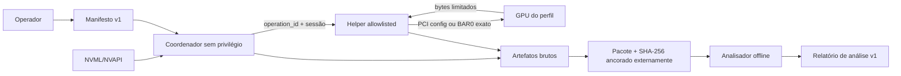

# Arquitetura de engenharia

## Canal térmico direto da NVAPI

No Windows, `rtxmon_read_private_thermal_channels` resolve opcionalmente a interface NVAPI `0x65fe3aad` e lê diretamente do driver os canais 0 e 1. A aquisição não inicia, não se anexa nem consulta o GPU-Z. Os valores são retornados em milésimos de grau Celsius depois da conversão do ponto fixo com oito bits fracionários.

Esse provedor é independente da telemetria pública: se a função estiver ausente, retornar erro ou produzir um valor fora dos limites defensivos, a chamada falha sem afetar a NVML, o inventário público ou o serviço existente.

## Objetivo e fronteira da verdade

O sistema deve observar, com baixa sobrecarga e sem alterar o estado da placa, a temperatura corrente que o driver NVIDIA associa ao die e inventariar todos os canais térmicos que as APIs públicas realmente expõem.

O dado autoritativo do software é:

```text
NVML device handle + NVML_TEMPERATURE_GPU -> temperatura inteira em °C
```

O inventário usa um segundo contrato de verdade:

```text
placa PCI/VBIOS + provedor + índice nativo + alvo + controlador + estado -> capability observada
```

O programa não afirma acesso elétrico direto ao sensor. Registradores térmicos privados, MMIO, SMBus, I2C/DDC e detalhes do microcontrolador da placa não têm um contrato térmico público estável. A calibração permanece sob controle do firmware/driver NVIDIA.

## Componentes

| Componente | Linguagem | Responsabilidade |
|---|---|---|
| `rtxmon_native` / `rtxmon.c` | C11 | Ciclo de vida, ABI pública, identidade da GPU/placa e leitura principal do die. |
| `thermal_scan.c` | C11 | Provedores térmicos, correlação PCI NVML/NVAPI e montagem do snapshot de capabilities. |
| `public_telemetry.c` | C11 | Catálogo fechado de campos documentados, consulta e estado por campo. |
| `rtxmon.h` | ABI C | Contrato binário versionado compartilhado por qualquer consumidor. |
| `rtxmon_core` | C++20 | RAII, exceções tipadas, modelos de GPU/amostra e conversão de tempo. |
| `sampler.cpp` / `sampler.hpp` | C++20 | Seleção por UUID, eventos, backoff, reconexão e buffer circular limitado. |
| `alerts.cpp` / `alerts.hpp` | C++20 | Máquina de estados de limiar/histerese sobre a temperatura de cada amostra. |
| `metrics.cpp` / `metrics.hpp` | C++20 | Janela limitada e métricas calculadas com fórmula, entradas e estado. |
| `rtxmon` | C++20 | CLI de amostra, watch resiliente, GPUs, capabilities e alertas; JSON versionado. |
| `RtxMonitor.Managed` | C#/.NET 8 | P/Invoke, `SafeHandle`, layouts verificados, sampler resiliente e avaliador de alertas equivalentes. |
| `RtxMonitor.Storage` | C#/.NET 8 | SQLite, migrações, execuções, instantâneos de identidade, retenção, consultas e exportação de evidências. |
| `RtxMonitor.Console` | C#/.NET 8 | Dashboard de terminal, eventos de disponibilidade, alertas, estatísticas e saída JSON. |
| `RtxMonitor.Service` | C#/.NET 8 | Supervisor headless, um coletor por UUID, Windows Service, HTTP local, SSE e saúde. |

## Fluxo de uma leitura

1. O consumidor cria um contexto.
2. A camada C carrega a biblioteca NVML por caminho confiável.
3. `nvmlInit_v2` estabelece a sessão com o driver.
4. O índice solicitado é confrontado com `nvmlDeviceGetCount_v2`.
5. `nvmlDeviceGetHandleByIndex_v2` obtém um handle atual do dispositivo.
6. A camada tenta `nvmlDeviceGetTemperatureV` com uma estrutura NVML v1 e sensor `NVML_TEMPERATURE_GPU`.
7. Se o símbolo/API moderna não existir, usa `nvmlDeviceGetTemperature` como fallback explícito.
8. O timestamp UTC é capturado imediatamente após o sucesso.
9. C++ ou C# apresentam o valor sem interpolar ou acrescentar precisão fictícia.

Buscar o handle em cada amostra evita manter um handle opaco além de um reset do driver. A frequência padrão é 1 Hz; 100 ms é o mínimo exposto para evitar polling acidentalmente agressivo.

## Fluxo do inventário térmico

1. NVML fornece identidade PCI e versão VBIOS da GPU selecionada.
2. `nvmlDeviceGetThermalSettings(..., ALL, ...)` retorna até três descritores de sensor.
3. `nvmlDeviceGetFieldValues` consulta especificamente `NVML_FI_DEV_MEMORY_TEMP` (campo 82).
4. No Windows, NVAPI enumera GPUs físicas e a camada C encontra a correspondência por bus, slot, device ID e subsystem ID.
5. `NvAPI_GPU_GetThermalSettings(..., ALL, ...)` retorna até três descritores públicos adicionais.
6. Cada tentativa gera um estado explícito: `available`, `not_supported`, `provider_unavailable` ou `query_failed`.
7. Alvo e controlador são normalizados, mas fonte, índice e código nativo permanecem no relatório.

Não há deduplicação semântica: duas APIs que reportam o mesmo die continuam como duas observações independentes. Isso permite comparar as fontes e evita alegar que sensores com nomes parecidos são fisicamente idênticos.

## Fluxo da telemetria pública

1. O consumidor solicita `rtxmon_read_public_telemetry` para um índice validado.
2. A camada C monta um snapshot com timestamp e consulta apenas a allowlist documentada.
3. Campos 82, 83, 185–190 e 192–196 são enviados a `nvmlDeviceGetFieldValues`; as outras métricas usam funções NVML específicas.
4. Cada ventoinha recebe um registro próprio quando a função v2 fornece a quantidade e os índices das ventoinhas.
5. Cada consulta preserva provedor exato, ID/seletor, tipo, unidade, código nativo e estado. Ausência mantém valores nulos.
6. O motor C++ recebe o snapshot, atualiza uma janela limitada e produz quatro métricas rotuladas como `computed`.
7. C++ e C# emitem o mesmo catálogo em `--telemetry`; o sampler incorpora os dois relatórios no evento `sample` v3.

O catálogo tem 31 campos semânticos e capacidade para 48 registros por causa das ventoinhas repetíveis. A especificação completa está em [`PUBLIC_TELEMETRY.md`](PUBLIC_TELEMETRY.md), e a decisão em [ADR 0007](adr/0007-public-telemetry-and-computed-metrics.md).

## Fluxo do monitoramento resiliente

1. O CLI resolve o índice inicial para UUID, ou recebe `--gpu-uuid` diretamente.
2. O sampler abre uma sessão curta de monitoramento e enumera as GPUs.
3. O alvo é localizado por comparação de UUID sem distinção de maiúsculas e minúsculas.
4. Uma leitura válida produz `sample` e zera o contador de falhas.
5. Uma falha recuperável produz `gap`, descarta a sessão e não conserva temperatura atual.
6. A próxima tentativa espera 250 ms; falhas sucessivas dobram o intervalo até o limite de 5 s.
7. Uma nova sessão enumera novamente as placas e pode encontrar o UUID em outro índice.
8. O primeiro sucesso após falhas produz `recovered` seguido por `sample`.
9. Cada evento recebe sequência crescente e entra em um buffer circular de capacidade fixa.

`--count` conta somente amostras bem-sucedidas. O buffer padrão mantém os 256 eventos mais recentes e pode ser configurado entre 1 e 65536. Ele não é persistência em disco.

A fábrica de sessões é injetável em C++ e C#. Os testes usam sessões simuladas para reproduzir perda da GPU, driver indisponível, mudança de índice e recuperação sem carregar NVML ou exigir hardware NVIDIA.

A saída `--watch --json` permanece compatível com o schema de amostra v1 e envia diagnósticos de lacuna para `stderr`. O modo opt-in `--watch --events` envia todos os eventos em JSON Lines.

## Fluxo de alertas

1. `--alert-threshold C` cria um `AlertEvaluator` com o limiar e, opcionalmente, `--alert-hysteresis C`.
2. A cada evento `sample` do sampler resiliente, o CLI passa a temperatura ao avaliador; `gap` e `recovered` não o alimentam.
3. A primeira amostra com `temperature_c >= threshold_c` produz `alert_raised`; o avaliador permanece alarmado até a condição de saída.
4. Com histerese zero, a primeira amostra abaixo do limiar produz `alert_cleared`; com histerese positiva, a transição ocorre em `temperature_c <= threshold_c - hysteresis_c`.
5. O evento de alerta reaproveita o envelope da amostra que disparou a transição (GPU, leitura, timestamp), e o CLI atribui uma única sequência crescente a todos os eventos do stream de saída.
6. Sem `--events`, o alerta é impresso como diagnóstico em `stderr`, preservando o schema de amostra v1 em `--json`. Com `--events`, entra no mesmo stream JSON Lines das amostras, lacunas e recuperações.

O avaliador não conhece sessão, GPU, thread ou relógio: é uma máquina de estados pura sobre um inteiro, testável sem `ResilientSampler` e sem GPU. O limiar é uma política escolhida por quem monitora, não um fato reportado pelo driver — ver [ADR 0004](adr/0004-threshold-alerts.md).

## Fluxo da persistência

1. `--watch --database PATH` abre ou cria o banco e aplica as migrações conhecidas.
2. WAL, foreign keys, timeout de bloqueio e `synchronous=NORMAL` são configurados antes da primeira gravação.
3. A retenção remove dados fora da janela e um novo `run_id` registra configuração, versão e ambiente.
4. Quando a GPU aparece, um snapshot preserva UUID, índice, driver, NVML, PCI, VBIOS e profile key. Uma falha de captura também é registrada, sem inventar os campos ausentes.
5. Cada evento recebe a sequência global do stream e é confirmado em uma transação antes de ser apresentado ao consumidor.
6. `(run_id, stream_sequence)` torna a repetição idempotente; conteúdo diferente na mesma sequência é conflito, não atualização.
7. Encerramento normal, `Ctrl+C` ou erro atualizam o run. A ausência de `completed_at_unix_ms` indica que nenhum encerramento foi confirmado.

O banco mantém o evento original no schema v3 e colunas indexadas para consulta. O schema SQLite permanece 1 porque o JSON já é armazenado integralmente; runs históricos v2 continuam legíveis. `--history --json` e `--export` acrescentam o contexto do run e do snapshot conforme [`evidence-record-v1.schema.json`](schema/evidence-record-v1.schema.json). Um snapshot associado a uma lacuna é contexto anterior conhecido, não uma afirmação de que a GPU estava acessível naquele instante — ver [ADR 0005](adr/0005-sqlite-evidence-store.md).

## Fluxo do serviço local

1. O host abre o SQLite, verifica integridade, aplica retenção e publica o estado em `/health`.
2. A descoberta enumera as GPUs e captura identidades e capacidades. As falhas do driver permanecem explícitas e são tentadas novamente.
3. Um dicionário por UUID inicia no máximo um `ResilientSampler` para cada GPU observada.
4. Cada coletor cria seu próprio run, snapshot de placa e sequência lógica.
5. O evento é confirmado no SQLite antes de ser publicado ao broker SSE.
6. `/api/v1/gpus`, `/capabilities` e `/telemetry` leem snapshots imutáveis; não iniciam sessões nativas por requisição.
7. `/api/v1/history` executa consultas limitadas no mesmo armazenamento WAL.
8. Cada assinante de `/api/v1/events` recebe uma fila privada e limitada. `TryWrite` nunca bloqueia o coletor.
9. Quando a fila enche, o serviço preserva o evento no banco, mantém as entregas seguintes na mesma lacuna e envia `stream_gap` ao cliente lento antes de reabrir sua fila.
10. No desligamento, todos os coletores são cancelados e seus runs recebem `service_stopped` antes do host encerrar.

Kestrel escuta HTTP/1.1 apenas em `127.0.0.1`. O `event_id` confirmado pelo SQLite também é o `id` do SSE, permitindo recuperar uma lacuna em `/api/v1/history?order=asc&after_event_id=...`. O contrato está em [`service-v1.openapi.json`](openapi/service-v1.openapi.json) e a decisão completa no [ADR 0006](adr/0006-loopback-headless-service.md).

## ABI C

A fronteira nativa é C, não C++, porque nomes, exceções e layouts C++ não formam uma ABI estável entre compiladores. Os contratos usam tipos de largura fixa e estruturas com `struct_size`:

- `rtxmon_gpu_info_t`: índice, nome, UUID e versões de driver/NVML;
- `rtxmon_temperature_sample_t`: índice, °C, tipo de sensor, backend e timestamp Unix em ms;
- `rtxmon_board_identity_t`: IDs PCI, endereço de barramento, flags de validade e VBIOS;
- `rtxmon_thermal_provider_result_t`: disponibilidade da superfície de API e código nativo;
- `rtxmon_thermal_capability_t`: fonte, ID nativo do provedor, alvo, controlador, valores válidos, estado e confiança;
- `rtxmon_thermal_report_t`: snapshot fixo de três provedores e até oito registros;
- `rtxmon_public_field_value_t`: valor bruto, provedor, ID, estado, origem, tipo, unidade e timestamp;
- `rtxmon_public_telemetry_report_t`: até 48 registros para 31 campos semânticos e ventoinhas repetíveis;
- `rtxmon_metrics_options_t`: janela, limiar e limite de amostras;
- `rtxmon_computed_metric_t`: fórmula identificada, estado, valor, janela e entradas;
- `rtxmon_computed_metrics_report_t`: quatro métricas calculadas no mesmo timestamp do snapshot;
- `rtxmon_status_t`: erros de argumento, backend, driver, permissão, suporte, GPU perdida e incompatibilidade de ABI.

O chamador inicializa `struct_size`; a DLL rejeita um layout menor. A ABI atual é `RTXMON_ABI_VERSION = 3`. Os layouts são testados em C e novamente medidos pelo runtime .NET antes da abertura do contexto.

### Semântica de disponibilidade

`provider.state = available` significa que a função pública pôde ser chamada. Cada capability possui seu próprio estado. Assim, o provedor `nvmlDeviceGetFieldValues` pode estar disponível enquanto o campo de temperatura da memória retorna `not_supported` para uma placa específica. `capability_count` é a quantidade de registros produzidos pelo provedor, inclusive registros negativos auditáveis.

`confidence = driver_reported` significa que a definição do canal e, quando presente, seu valor vieram do contrato do driver. O projeto reserva `experimental`, mas a fase atual não produz leituras experimentais.

## Concorrência e ciclo de vida

NVML é documentada como thread-safe. A tabela de símbolos no contexto é imutável depois da inicialização, e cada leitura usa apenas estado local. Diagnósticos ficam em armazenamento thread-local. Chamadas NVAPI são serializadas no processo porque o contrato público não oferece a mesma garantia de concorrência.

Os objetos ADO.NET do SQLite não são compartilhados entre threads. `RtxMonitor.Storage` abre uma conexão curta por operação e usa pool de conexões, WAL e transações. Assim, os processos de gravação concorrentes disputam apenas a confirmação necessária, e os leitores não reutilizam um `SqliteConnection` global.

Regras do contrato:

- um contexto pode atender leituras concorrentes;
- o contexto não pode ser destruído enquanto houver uma chamada em andamento;
- C++ controla o contexto por RAII;
- C# controla o ponteiro por `SafeHandle`;
- cada instância do sampler tem um único proprietário e não deve receber chamadas `poll` concorrentes;
- o supervisor do serviço mantém no máximo um coletor ativo por UUID;
- a fila SSE pertence ao cliente e nunca é compartilhada como buffer autoritativo;
- publicação SSE ocorre somente depois da confirmação do evento no SQLite;
- toda criação bem-sucedida corresponde a um `nvmlShutdown`;
- toda inicialização NVAPI bem-sucedida corresponde a `NvAPI_Unload`.

## Segurança

O projeto não carrega DLLs NVIDIA do diretório atual nem de um `PATH` arbitrário. No Windows, tenta:

1. `%SystemRoot%\System32\nvml.dll` para drivers DCH;
2. `%ProgramW6432%\NVIDIA Corporation\NVSMI\nvml.dll` para instalação padrão.

NVAPI é carregada exclusivamente como `%SystemRoot%\System32\nvapi64.dll` (ou `nvapi.dll` em 32 bits).

Não há API para escrever clocks, fan, tensão, power limit ou configuração do driver. Também não há transação I2C, mapeamento MMIO, leitura de ROM ou driver kernel próprio. Não há execução de shell na biblioteca ou nos aplicativos. `nvidia-smi` aparece apenas no script de verificação como referência externa independente.

O serviço cria seu endpoint por código em `127.0.0.1`. Argumentos `--urls` e variáveis `ASPNETCORE_URLS` não substituem esse bind. O serviço atual não habilita CORS, proxy reverso, endpoint de escrita, autenticação remota ou exposição em `0.0.0.0`. HTTP sem TLS é restrito ao loopback; qualquer acesso de rede exigirá autenticação, TLS e um ADR próprio.

## Modelo de falhas

Falhas não são convertidas em zero grau nem em dados antigos. Cada camada propaga um status explícito:

- biblioteca ausente;
- símbolo requerido ausente;
- driver não carregado;
- acesso negado;
- índice de GPU inexistente;
- sensor não suportado;
- GPU perdida;
- ABI incompatível;
- erro NVML preservado com texto e código.

Nos modos `--once`, `--capabilities` e `--telemetry`, uma falha do relatório inteiro continua encerrando o comando. Falhas individuais dentro do catálogo permanecem no relatório. No modo watch, estados recuperáveis são convertidos em lacunas e novas tentativas com backoff. Estados que indicam erro de uso, permissão, falta de memória, sensor não suportado ou ABI incompatível continuam fatais.

Persistência é opt-in. Sem `--database`, uma falha ou ausência do SQLite não participa da coleta. Com `--database`, gravar cada evento faz parte do contrato solicitado: uma falha encerra o monitor em vez de continuar enquanto perde evidências silenciosamente. Consultas não criam um banco ausente, schemas futuros são recusados e arquivos inválidos não são substituídos.

No serviço, a persistência é obrigatória. Se o SQLite não abrir ou uma confirmação falhar, os coletores são interrompidos para impedir emissão sem evidência. O processo HTTP continua ativo, `/health` retorna `503` enquanto o banco não está pronto e o supervisor tenta recuperá-lo em intervalos limitados. Uma falha na descoberta deixa o serviço disponível para consultas ao histórico, mas com estado `degraded` e diagnóstico do driver.

O sampler nunca repete uma amostra anterior durante a indisponibilidade. Uma lacuna contém status, diagnóstico, quantidade de falhas consecutivas e atraso até a próxima tentativa. A sessão nativa é descartada para que a tentativa seguinte recarregue o contexto e resolva novamente o UUID.

O inventário tem uma política diferente: uma falha individual de provedor não invalida o relatório inteiro. O snapshot retorna com o estado e o código nativo da falha para permitir diagnóstico e comparação entre máquinas.

## Dados e observabilidade

Cada JSON contém:

```json
{
  "schema_version": 1,
  "gpu_index": 0,
  "gpu_name": "NVIDIA GeForce RTX ...",
  "gpu_uuid": "GPU-...",
  "temperature_c": 48,
  "sensor": "gpu_die",
  "backend": "NVML nvmlDeviceGetTemperatureV",
  "timestamp_unix_ms": 1787589572574
}
```

`temperature_c` permanece inteiro porque essa é a resolução do contrato NVML utilizado. A média exibida pelo dashboard é uma estatística de várias amostras, não uma leitura com maior precisão física.

O comando `--capabilities --json` usa `schema_version: 2` e separa:

- `gpu`: identidade lógica por índice/UUID e versões do driver/NVML;
- `board`: identidade física PCI, VBIOS e uma chave de perfil reproduzível;
- `providers`: estado de cada superfície pública;
- `thermal_capabilities`: observações com proveniência completa e temperaturas anuláveis.

O contrato serializado é formalizado em [`docs/schema/capabilities-v2.schema.json`](schema/capabilities-v2.schema.json).

O comando `--watch --events` usa o schema independente [`docs/schema/telemetry-event-v3.schema.json`](schema/telemetry-event-v3.schema.json). Cada envelope contém:

- `event_type`: `sample`, `gap`, `recovered`, `alert_raised` ou `alert_cleared`;
- `sequence` global e crescente dentro de um processo, além do horário observado;
- UUID persistente e índice atual anulável;
- status normalizado, código e diagnóstico;
- contagem de falhas e próximo backoff;
- amostra anulável, presente em `sample`, `alert_raised` e `alert_cleared`;
- `alert_threshold_c`/`alert_hysteresis_c`, anuláveis, presentes somente nos dois tipos de alerta.
- `public_telemetry`, com cobertura e valores brutos, presente nas amostras quando o provedor suporta o catálogo;
- `computed_metrics`, com quatro fórmulas rastreáveis, presente junto do relatório público.

Os schemas [`telemetry-event-v1.schema.json`](schema/telemetry-event-v1.schema.json) e [`telemetry-event-v2.schema.json`](schema/telemetry-event-v2.schema.json) permanecem publicados e imutáveis para validar streams históricos.

O armazenamento usa schema SQLite 1. A exportação usa [`evidence-record-v1.schema.json`](schema/evidence-record-v1.schema.json) e aceita eventos v2 ou v3 sem renomear campos. O envelope acrescenta `event_id`, horário de armazenamento, run, ambiente e snapshot da placa; essa proveniência não altera o fato observado no evento.

O serviço usa API schema 1. Respostas HTTP são documentadas no OpenAPI; `/telemetry` expõe o último relatório confirmado, eventos SSE `telemetry` usam [`live-telemetry-v1.schema.json`](schema/live-telemetry-v1.schema.json), e descartes de entrega para clientes lentos usam [`stream-gap-v1.schema.json`](schema/stream-gap-v1.schema.json). A lista de GPUs expõe somente `last_sample_temperature_c` com o horário da amostra; esse campo não é renomeado para temperatura atual durante uma lacuna.

## Evolução da arquitetura

O [roadmap de engenharia](ROADMAP.md) separa a evolução em duas trilhas:

- **estável:** persistência SQLite, serviço local, telemetria documentada e métricas calculadas já implementados;
- **experimental:** laboratório reproduzível, aquisição privilegiada somente leitura, correlação e perfis validados por placa.

A trilha experimental não entra nesta ABI por conveniência. Ela tem processo, protocolo, schemas e namespace próprios, com ativação explícita. Somente um resultado que atenda aos critérios de evidência do roadmap poderá ser oferecido como perfil experimental; a ausência de perfil exato deve falhar sem produzir valor.

Qualquer threshold deve ser rotulado como política ou limite fornecido pelo driver; qualquer fórmula deve ser rotulada como cálculo; e qualquer leitura não documentada deve preservar o valor bruto e seu estágio de evidência. Nenhum deles deve ser apresentado como propriedade universal de toda RTX.

## Arquitetura experimental da v0.8.0

A v0.8.0 introduz quatro componentes planejados, removíveis em conjunto e sem dependência do serviço estável:

| Componente | Privilégio | Responsabilidade |
|---|---|---|
| Coordenador de laboratório | Usuário comum; Administrador somente nas observações anexadas ou para abrir o futuro helper | Criar manifesto, marcar cenários, capturar a linha de base pública e solicitar operações por `operation_id` |
| Helper experimental | Processo elevado e, no Windows, driver KMDF assinado/HVCI | Validar identidade e allowlist novamente, ler somente PCI config ou BAR0 autorizado e devolver bytes limitados |
| Empacotador de evidências | Usuário comum no Windows; backend Unix ainda planejado | Preservar payloads sem transformação, calcular SHA-256 e devolver o hash que será ancorado fora do pacote |
| Analisador offline | Usuário comum, sem handle para hardware | Ler apenas pacotes verificados contra a âncora externa, gerar estatísticas e classificar candidatos |



O coordenador nunca envia um endereço livre para o kernel. Ele solicita uma operação conhecida; o helper resolve e valida o espaço, offset, largura, alinhamento, limite de bytes, quantidade de amostras e taxa a partir de sua própria allowlist. A identidade PCI observada deve corresponder ao perfil antes de cada sessão. Arquivos de manifesto e configuração fornecidos pelo usuário podem restringir uma operação, mas nunca ampliá-la.

O único BAR admissível na v0.8.0 é BAR0, em offsets pontuais com hipótese e revisão prévias. BAR1, VRAM, DMA, memória física arbitrária, ROM PCI, I2C, DDC, SMBus, varredura e toda operação de escrita ficam fora da arquitetura. O helper não expõe mapeamento de BAR ou ponteiro ao cliente.

VBIOS entra exclusivamente como artefato offline fornecido pelo operador. O laboratório registra origem declarada, tamanho e SHA-256 antes do parsing; não habilita ROM, não captura VBIOS da placa e não inclui a imagem no Git. O descritor pode ser compartilhado, mas a distribuição do payload depende da licença e da legislação aplicáveis.

O MVP executável empacota um único arquivo local em `manifest.json` mais `artifact/payload.bin`. Seu contrato exato é [`artifact-package-manifest-v1.schema.json`](schema/artifact-package-manifest-v1.schema.json), o descritor embutido usa [`raw-artifact-v1.schema.json`](schema/raw-artifact-v1.schema.json), a saída de sucesso usa [`evidence-package-v1.schema.json`](schema/evidence-package-v1.schema.json) e a saída de erro usa [`lab-command-error-v1.schema.json`](schema/lab-command-error-v1.schema.json).

O analisador `rtxmon-vbios` já implementa a etapa offline limitada no Windows: lê o caminho fornecido pelo operador até 16 MiB, valida a cadeia PCI ROM, `PCIR`, checksum legacy e BIT 1.00 com aritmética checked e emite [`vbios-analysis-v1.schema.json`](schema/vbios-analysis-v1.schema.json). Caminhos remotos, de dispositivo, streams alternativos e reparse points são rejeitados. Em outras plataformas, o CLI v0.8 devolve `unsupported_platform` antes de validar ou abrir o path; a biblioteca recebe apenas bytes já carregados e permanece portátil, pura e sem acesso a hardware.

O importador C# `analyze-gpuz-log` cria uma série externa de referência conforme [`gpuz-reference-analysis-v1.schema.json`](schema/gpuz-reference-analysis-v1.schema.json). Ele preserva hash, codificação, horários locais, ordem dos canais e valores brutos, e deriva somente estatísticas e cadência. Canais da placa (`gpu_board`) e do host (`host_system`) permanecem separados. Esse relatório não entra no serviço ou na ABI estável e não afirma conhecer a interface privada usada pelo GPU-Z.

O comando `mark` produz marcadores JSONL conforme [`experiment-marker-v1.schema.json`](schema/experiment-marker-v1.schema.json). Cada marcador contém UTC para alinhamento externo e o relógio monotônico do sistema para medir ordem e duração sem depender de ajustes no relógio civil. O marcador é uma evidência de sincronização, não uma leitura de sensor.

O comando `correlate-gpuz-log` calcula Pearson de defasagem zero entre um canal numérico de referência e os demais canais numéricos do mesmo artefato. A saída [`gpuz-correlation-v1.schema.json`](schema/gpuz-correlation-v1.schema.json) mantém canal, unidade, escopo, quantidade de pares e motivo quando o coeficiente não pode ser calculado. Essa análise mede co-movimento; ela não promove um canal a sensor identificado.

O tracing NVAPI opt-in produz três observações limitadas: IDs passados a `nvapi_QueryInterface` em [`nvapi-query-observation-v1.schema.json`](schema/nvapi-query-observation-v1.schema.json), resultados normalizados por módulo/hash/RVA em [`nvapi-interface-resolution-v1.schema.json`](schema/nvapi-interface-resolution-v1.schema.json) e entradas realmente executadas em [`nvapi-call-observation-v1.schema.json`](schema/nvapi-call-observation-v1.schema.json). Os breakpoints observam o fluxo existente do GPU-Z; não chamam as funções e não inspecionam seus argumentos ou buffers.

`classify-nvapi-ids` cruza a consulta com um `nvapi_interface.h` fornecido pelo operador. `inventory-nvapi-candidates` une classificação e execução em [`nvapi-candidate-inventory-v1.schema.json`](schema/nvapi-candidate-inventory-v1.schema.json). As etapas são offline, fixam hashes dos artefatos e preservam uma escada de evidência: consultado → resolvido → executado no polling → atribuído estaticamente → ABI demonstrada → campo correlacionado → validado externamente. `not_in_public_catalog` e `unidentified_binary_candidate` nunca significam descoberta de uma API térmica privada.

O anexo tardio específico para candidatos segue [`nvapi-candidate-call-observation-v1.schema.json`](schema/nvapi-candidate-call-observation-v1.schema.json). A primeira passagem registra somente entradas de função, threads e call sites normalizados. Uma segunda passagem pode limitar-se aos candidatos privados já observados e registrar seis palavras de entrada sem dereferenciar ponteiros. Na captura real, 19 alvos participaram do polling, incluindo 11 não catalogados; `NvAPI_GPU_GetThermalSettings` não participou. A análise do `nvapi_impl.dll` fixado por hash ligou `0x65fe3aad`/RVA `0x001ad310` às mensagens de versão de `NvAPI_GPU_ThermChannelGetStatus`, além de atribuir famílias de tensão e fan/cooler a dois outros candidatos.

O perfil térmico avança dois degraus adicionais sem ampliar o coletor genérico. Disassembly estático e dinâmico demonstrou estrutura v2 de 168 bytes, máscara por canal, palavras 10/11 e escala de ponto fixo 8. [`capture-gpuz-nvapi-therm-channel-v2.ps1`](../scripts/capture-gpuz-nvapi-therm-channel-v2.ps1) observa somente o ponto pós-retorno allowlisted, lê o buffer que o GPU-Z já forneceu e emite [`nvapi-therm-channel-v2-observation-v1.schema.json`](schema/nvapi-therm-channel-v2-observation-v1.schema.json). O analisador offline `correlate-nvapi-therm-channel` compara o prefixo ancorado do log e emite [`nvapi-therm-channel-correlation-v1.schema.json`](schema/nvapi-therm-channel-correlation-v1.schema.json).

No perfil testado, canal 0 correspondeu a `GPU Temperature` e canal 1 a `Hot Spot`, com erro máximo de `0,05` °C e alternativa invertida mais de 10 °C distante em média. A arquitetura classifica isso como `matched_external_reference`: a origem computacional está identificada para os hashes e a placa registrados, mas a interface não é pública, a construção física do sensor não foi provada e o resultado não entra na ABI estável.

Uma janela só é classificada como polling quando a série de referência cresce antes, durante e depois da observação. O primeiro detach histórico interrompeu o logging do GPU-Z apesar de manter sua GUI responsiva; os dados posteriores foram marcados como atividade de fundo. A captura térmica válida foi executada em uma sessão nova, comprovou os três pontos de crescimento, preservou o processo responsivo e não deixou debugger anexado.

A observação real do GPU-Z também revelou um helper próprio, assinado e temporário, com caminhos de leitura e escrita de baixo nível. Ele é tratado como objeto de análise de terceiro, não como backend do RTX Monitor. O coletor anexado registra apenas chamadas que o GPU-Z já faria, sem reiniciar o processo, emitir IOCTL ou ler buffers de saída. Código, tamanhos e entradas limitadas de 4 ou 12 bytes seguem [`gpuz-device-io-control-observation-v1.schema.json`](schema/gpuz-device-io-control-observation-v1.schema.json) e [`gpuz-device-io-control-input-v1.schema.json`](schema/gpuz-device-io-control-input-v1.schema.json). O comando `resolve-windows-handle` ancora a identidade do objeto observado em [`windows-handle-identity-v1.schema.json`](schema/windows-handle-identity-v1.schema.json).

Na RTX 3060 analisada, o handle era um objeto `File` para `\Device\GPU-Z-v8`. Os únicos códigos observados no polling da aba `Sensors` foram `0x80006040`, ligado estaticamente a `RDMSR` com seletor Intel `0x19c` (`IA32_THERM_STATUS`), e `0x800060c0`, ligado a leituras de configuração PCI por `HalGetBusDataByOffset`. O primeiro descreve estado térmico da CPU; o segundo consulta bytes PCI da RTX. Nenhum deles é a origem direta do `Hot Spot` da GPU. Essa conclusão usa fluxo do handler e formato da entrada, não apenas correlação temporal.

Device object, códigos e entradas entram somente como **evidência passiva do laboratório**. Eles não entram como provider de telemetria e não autorizam reproduzir a interface privada. Um transporte experimental do projeto precisa continuar sendo próprio, revisável, somente leitura, allowlisted e independente desse binário proprietário.

O módulo C++ puro [`rm_thermal_protocol.hpp`](../cpp/include/rtxmon/lab/rm_thermal_protocol.hpp) representa somente o ABI publicado de `THERMAL_SYSTEM_EXECUTE_V2`: tamanhos, comandos, opcodes, requests em duas fases e validação de respostas. Ele não contém syscall, IOCTL, `D3DKMT_ESCAPE`, handle NVAPI/RM ou acesso ao driver. O transporte permanece uma porta separada; adicionar uma implementação Windows exige fonte primária para a rota WDDM, correspondência de versão e um teste que prove somente leitura antes de habilitá-la.

O manifesto completo [`experiment-manifest-v1.schema.json`](schema/experiment-manifest-v1.schema.json) e o relatório [`analysis-report-v1.schema.json`](schema/analysis-report-v1.schema.json) são contratos planejados para as etapas restantes da v0.8.0; o CLI MVP ainda não os emite. Nenhum desses contratos altera a ABI C, os schemas de telemetria, o banco SQLite ou a API HTTP estável.
