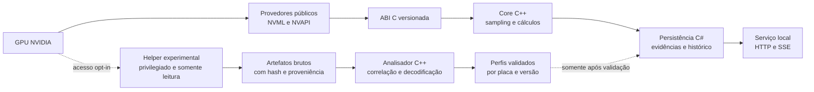

# Roadmap de engenharia

## Objetivo

O RTX Monitor deve evoluir de um leitor confiável das APIs públicas para uma plataforma de pesquisa capaz de investigar dados não documentados da placa.

O resultado esperado não é apenas encontrar números que mudam. O projeto deve conseguir responder, para cada valor:

- de onde ele veio;
- em qual placa, VBIOS e driver foi observado;
- qual unidade e fórmula foram usadas;
- quais testes sustentam a interpretação;
- qual é o nível de confiança da conclusão.

Engenharia reversa entra no plano, mas fica isolada do monitor estável. Um valor desconhecido nunca será publicado como temperatura de hotspot, VRM ou memória apenas porque acompanha a carga da GPU.

## Duas trilhas, uma base comum

### Trilha estável

Usa contratos documentados do driver, funciona sem privilégio administrativo e mantém compatibilidade de ABI e schemas. É a parte adequada para uso diário.

### Trilha experimental

Investiga artefatos e canais não documentados. Exige ativação explícita, perfil exato da placa e isolamento de privilégios. Seus resultados carregam evidência e nunca substituem silenciosamente um dado estável.

## Como o projeto descreve a verdade

Cada dado terá uma origem e, quando experimental, um estágio de evidência.

### Origem

| Origem | Significado | Pode receber nome físico? |
| --- | --- | --- |
| `driver_reported` | Nome, valor e unidade vieram de uma API documentada | Sim, usando o nome do contrato oficial |
| `computed` | Resultado de uma fórmula sobre entradas identificadas | Somente como métrica calculada, nunca como sensor |
| `experimental` | Valor obtido fora das APIs públicas estáveis | Somente depois dos critérios de validação |

### Evidência experimental

| Estágio | O que sabemos | Como deve aparecer |
| --- | --- | --- |
| `raw_unknown` | Endereço, largura e bytes observados | Valor bruto desconhecido |
| `correlated` | O valor acompanha um estímulo de forma repetível | Candidato, sem nome físico definitivo |
| `externally_validated` | Escala e comportamento foram comparados com uma referência independente | Candidato validado para o perfil testado |

`computed` e `experimental` não são sinônimos. Por exemplo, a inclinação da temperatura do die é uma métrica calculada a partir de um sensor oficial; já um byte encontrado em uma região não documentada é uma observação experimental ainda sem significado.

## Responsabilidade por linguagem

| Camada | Linguagem principal | Responsabilidade |
| --- | --- | --- |
| Aquisição e ABI | C11 | Carregar provedores, obter identidade da placa e expor contratos binários pequenos e auditáveis |
| Core e análise | C++20 | Sampling, métricas calculadas, decodificadores, correlação e ferramentas offline |
| Serviço e persistência | C# / .NET | SQLite, ciclo de vida do serviço, API local, retenção e futura integração com interface |
| Acesso privilegiado futuro | C/C++ | Helper ou driver mínimo, separado, somente após ADR e threat model aprovados |

A interface gráfica não faz parte desta sequência inicial. Ela só deve consumir dados depois que persistência, serviço e classificação de evidência estiverem estáveis.

## Marcos

### v0.1.0 a v0.4.0 — base confiável

Estado: implementada no código atual.

- leitura do die por NVML;
- inventário público por NVML/NVAPI;
- identidade por UUID, PCI e VBIOS;
- sampler resiliente com lacunas e recuperação;
- alertas com limiar e histerese;
- schemas versionados e validação sem GPU no CI.

Essa base permanece estável enquanto as camadas seguintes são adicionadas.

### v0.5.0 — persistência e cadeia de evidências

Estado: implementada no código atual.

Objetivo: transformar o stream em histórico consultável e reproduzível.

Entregas:

- SQLite como armazenamento canônico local;
- migrations explícitas e schema versionado;
- gravação de `sample`, `gap`, `recovered`, `alert_raised` e `alert_cleared`;
- identidade completa: UUID, PCI, VBIOS, driver, NVML e chave de perfil;
- WAL, `busy_timeout`, transações curtas e política de retenção limitada;
- consultas por GPU, intervalo, tipo de evento e sequência;
- exportação preservando proveniência e versão do schema.

Critério de saída:

- reiniciar o processo não perde eventos já confirmados;
- migrations, retenção, concorrência, arquivo inválido e recuperação são testados;
- nenhuma lacuna é convertida em amostra e nenhum dado antigo vira leitura atual.

### v0.6.0 — serviço local headless

Objetivo: executar coleta e persistência continuamente, sem interface gráfica.

Entregas:

- host C# executável em console e como serviço do Windows;
- uma única instância do coletor por GPU;
- endpoints de saúde, GPUs, capabilities, eventos e histórico;
- HTTP e SSE apenas em loopback por padrão;
- limites de consulta, cancelamento, backpressure e desligamento gracioso;
- diagnóstico claro quando driver, GPU ou banco estiverem indisponíveis.

Critério de saída:

- instalação, início, parada, atualização e recuperação após falha são reproduzíveis;
- o serviço não expõe a rede externa por padrão;
- clientes lentos não bloqueiam aquisição nem persistência;
- não há GUI nesta versão.

### v0.7.0 — telemetria documentada e métricas calculadas

Objetivo: esgotar as fontes públicas antes de procurar registradores privados.

Entregas:

- catálogo dos campos públicos aplicáveis da NVML e da NVAPI;
- consulta somente por IDs conhecidos, preservando o status de cada campo;
- temperatura, potência, clocks, utilização, memória, throttling e fan quando a API e a placa publicarem esses dados;
- métricas calculadas, como inclinação térmica, tempo acima do limiar, delta entre canais conhecidos e média por janela;
- fórmula, unidade, janela, entradas e origem registradas com cada métrica;
- relatório de cobertura por combinação placa, VBIOS e driver.

Critério de saída:

- campo ausente continua `not_supported`, não zero;
- toda métrica calculada pode ser refeita a partir dos eventos armazenados;
- nenhuma estimativa recebe o nome de um sensor físico.

### v0.8.0 — laboratório reproduzível

Objetivo: criar os instrumentos que tornam uma hipótese de engenharia reversa verificável.

Entregas:

- manifesto de experimento com placa, IDs PCI, revisão, VBIOS e hash, driver, NVML, sistema e versão GSP quando observável;
- marcadores de cenário: repouso, carga gráfica, carga de memória e resfriamento;
- relógio monotônico para correlação e UTC para auditoria;
- pacote de evidências com dados públicos, artefatos brutos, comandos, hashes e observações;
- analisador offline para séries temporais, deltas, periodicidade e correlação;
- protocolo para referência independente, como termopar ou câmera térmica, com posição e limitações registradas;
- ambiente Linux de pesquisa documentado, separado do produto Windows.

Critério de saída:

- outra pessoa consegue repetir um experimento usando apenas o manifesto e os artefatos permitidos;
- duas execuções equivalentes produzem resultados comparáveis;
- a referência externa é tratada como temperatura do ponto medido, não como prova automática da junção interna.

O Linux é útil nesta etapa porque oferece interfaces PCI e `hwmon` documentadas e porque os módulos de kernel abertos da NVIDIA permitem estudar parte do caminho do driver. Isso não torna o firmware GSP público nem estável: o próprio projeto da NVIDIA informa que a ABI do firmware pode variar entre versões.

### v0.9.0 — aquisição experimental somente leitura

Objetivo: observar canais de baixo nível com risco controlado.

Ordem de investigação:

1. analisar offline código aberto, tabelas, logs e imagens de firmware fornecidas localmente;
2. observar espaço de configuração PCI e interfaces documentadas do sistema;
3. criar perfis de regiões e offsets somente quando houver hipótese e evidência prévias;
4. usar um helper privilegiado mínimo apenas para leituras que não podem ser feitas com segurança em user mode.

Entregas:

- processo experimental separado do coletor estável;
- IPC local com comandos, tamanhos e offsets em allowlist;
- perfil exato por `vendor:device/subvendor:subdevice`, revisão, VBIOS, driver e GSP;
- timeouts, limites de taxa, watchdog, auditoria e falha fechada;
- armazenamento do valor bruto antes de qualquer interpretação;
- ADR específico e threat model antes da primeira leitura privilegiada.

Não faz parte desta versão:

- varredura cega de MMIO, I2C, DDC ou SMBus;
- escrita em registradores, BARs, ROM ou firmware;
- flash de VBIOS;
- alteração de fan, clock, tensão ou limite de potência;
- execução de firmware desconhecido;
- driver Windows próprio antes de a necessidade ser demonstrada no laboratório Linux.

Critério de saída:

- toda leitura é autorizada por um perfil exato e reproduzível;
- placa, versão ou offset diferente é recusado;
- remover o componente experimental não muda o funcionamento da trilha estável;
- os testes demonstram que não há caminho de escrita no protocolo exposto.

Leitura de MMIO não é automaticamente inofensiva: alguns registradores podem ter efeitos colaterais, como limpar um estado ao serem lidos. Por isso, "somente leitura" também exige conhecimento do endereço, largura e semântica.

### v0.10.0 — correlação e validação de candidatos

Objetivo: transformar observações brutas em hipóteses testáveis.

Para promover `raw_unknown` a `correlated`, um canal deve:

- ser estável em repouso e variar de forma repetível sob um estímulo controlado;
- ter largura, endianess, sinal, escala, offset e frequência de atualização investigados;
- permanecer identificável após reinício e novas execuções no mesmo perfil;
- ser comparado com dados públicos e com canais vizinhos;
- ter falsos positivos e hipóteses alternativas documentados.

Para promover a `externally_validated`, também deve:

- ser comparado em várias faixas com uma referência independente adequada;
- repetir o comportamento em múltiplos ciclos de aquecimento e resfriamento;
- declarar erro, tolerância, posição física e limites do método;
- passar novamente pelos testes após mudança de driver, VBIOS ou firmware GSP.

Um resultado continua específico da placa testada. Evidência em uma RTX 3060 de um fabricante não autoriza aplicar o mesmo offset ou nome a outra RTX 3060, muito menos a toda a família RTX.

### v0.11.0 — provedor experimental por perfis

Objetivo: disponibilizar candidatos validados sem misturá-los à API estável.

Entregas:

- namespace e endpoint experimentais;
- ativação explícita pelo operador;
- manifests de perfil versionados e revisáveis;
- decodificadores com fórmula, unidade, tolerância e referências às evidências;
- valor bruto preservado ao lado do valor decodificado;
- revogação automática do perfil quando a identidade não corresponde;
- testes de regressão com fixtures, sem depender da GPU no CI.

Critério de saída:

- clientes distinguem um sensor oficial de um candidato experimental sem interpretar texto;
- o modo padrão não carrega o helper privilegiado;
- um perfil desconhecido não produz leitura aproximada.

### v1.0.0 — plataforma estável de monitoramento e pesquisa

Objetivo: estabilizar contratos, operação e governança das duas trilhas.

Entregas:

- ABI, schemas, banco e API local com política de compatibilidade;
- instalação e atualização documentadas;
- métricas públicas e calculadas suportadas como produto;
- canal experimental ainda opt-in, por perfil e com evidências;
- processo público para propor, revisar, validar e revogar perfis;
- pacote de diagnóstico que não inclua firmware proprietário nem dados sensíveis.

A interface gráfica poderá começar depois desta base, como cliente da API local. Ela não será a autoridade sobre aquisição, cálculo ou classificação dos dados.

## Portões obrigatórios da engenharia reversa

Antes de iniciar a v0.9.0, o projeto precisa ter:

- histórico persistente e exportável;
- identidade exata da placa e das versões envolvidas;
- protocolo de experimento repetível;
- ADR da superfície privilegiada;
- threat model e revisão do protocolo IPC;
- máquina ou ambiente de laboratório em que uma falha não interrompa trabalho importante;
- cópia de segurança dos dados, sem depender de backup de VBIOS como justificativa para escritas;
- revisão das licenças aplicáveis e da legislação local antes de distribuir dumps ou decodificadores.

O repositório não deve redistribuir firmware, VBIOS ou binários proprietários. Quando um artefato local for necessário, o experimento registra origem, versão e hash; o arquivo permanece com quem realizou a captura.

## O que define sucesso

O projeto terá avançado quando conseguir publicar algo como:

> No perfil exato X, o canal bruto Y apresentou a codificação Z, repetiu-se em N experimentos e foi validado com a referência R dentro da tolerância T.

Ele não terá avançado se publicar apenas:

> Este número sobe durante o benchmark, então deve ser o VRM.

Essa diferença é o que transforma exploração em engenharia.

## Referências técnicas primárias

- [NVIDIA NVML: consulta de valores por field ID](https://docs.nvidia.com/deploy/nvml-api/group__nvmlFieldValueQueries.html)
- [NVIDIA NVML: catálogo de field IDs públicos](https://docs.nvidia.com/deploy/nvml-api/group__nvmlFieldValueEnums.html)
- [NVIDIA Open GPU Kernel Modules](https://github.com/NVIDIA/open-gpu-kernel-modules)
- [NVIDIA: extração e compatibilidade do firmware GSP para Nouveau](https://github.com/NVIDIA/open-gpu-kernel-modules/blob/main/nouveau/extract-firmware-nouveau.txt)
- [Linux kernel: interface padronizada `hwmon`](https://docs.kernel.org/hwmon/sysfs-interface.html)
- [Linux kernel: acesso a recursos PCI via `sysfs`](https://docs.kernel.org/PCI/sysfs-pci.html)
