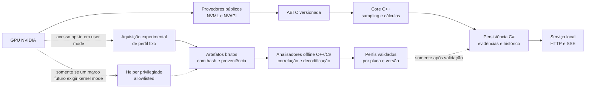

# Roadmap de engenharia

## Objetivo

O RTX Monitor deve evoluir de um leitor confiável das APIs públicas para uma plataforma de pesquisa capaz de investigar dados não documentados da Galax RTX 3060 de 12 GB do proprietário. Esse é o único hardware alvo, conforme escopo explicitado em 2026-09-05. Perfis representam configurações comprovadas desta mesma unidade; suportar outras placas não é objetivo do projeto.

O resultado esperado não é apenas encontrar números que mudam. O projeto deve conseguir responder, para cada valor:

- de onde ele veio;
- em qual placa, VBIOS e driver foi observado;
- qual unidade e fórmula foram usadas;
- quais testes sustentam a interpretação;
- qual é o nível de confiança da conclusão.

Engenharia reversa entra no plano, mas fica isolada do monitor estável. Um valor desconhecido nunca será publicado como temperatura de hotspot, VRM ou memória apenas porque acompanha a carga da GPU.

## Duas trilhas, uma base comum

### Trilha estável

Usa contratos documentados do driver, funciona sem privilégio administrativo e mantém compatibilidade de ABI e schemas. É a parte adequada para uso diário.

### Trilha experimental

Investiga artefatos e canais não documentados. Exige ativação explícita, perfil exato da placa e isolamento de privilégios. Seus resultados carregam evidência e nunca substituem silenciosamente um dado estável.

## Como o projeto descreve a verdade

Cada dado terá uma origem e, quando experimental, um estágio de evidência.

### Origem

| Origem | Significado | Pode receber nome físico? |
| --- | --- | --- |
| `driver_reported` | Nome, valor e unidade vieram de uma API documentada | Sim, usando o nome do contrato oficial |
| `computed` | Resultado de uma fórmula sobre entradas identificadas | Somente como métrica calculada, nunca como sensor |
| `experimental` | Valor obtido fora das APIs públicas estáveis | Somente depois dos critérios de validação |

### Evidência experimental

| Estágio | O que sabemos | Como deve aparecer |
| --- | --- | --- |
| `raw_unknown` | Endereço, largura e bytes observados | Valor bruto desconhecido |
| `correlated` | O valor acompanha um estímulo de forma repetível | Candidato, sem nome físico definitivo |
| `externally_validated` | Escala e comportamento foram comparados com uma referência independente | Candidato validado para o perfil testado |

`computed` e `experimental` não são sinônimos. Por exemplo, a inclinação da temperatura do die é uma métrica calculada a partir de um sensor oficial; já um byte encontrado em uma região não documentada é uma observação experimental ainda sem significado.

## Responsabilidade por linguagem

| Camada | Linguagem principal | Responsabilidade |
| --- | --- | --- |
| Aquisição e ABI | C11 | Carregar provedores, obter identidade da placa e expor contratos binários pequenos e auditáveis |
| Core e análise | C++20 | Sampling, métricas calculadas, decodificadores, correlação e ferramentas offline |
| Serviço e persistência | C# / .NET | SQLite, ciclo de vida do serviço, API local, retenção e futura integração com interface |
| Acesso privilegiado futuro | C/C++ | Helper ou driver mínimo, separado, somente após ADR e threat model aprovados |

A interface gráfica não faz parte desta sequência inicial. Ela só deve consumir dados depois que persistência, serviço e classificação de evidência estiverem estáveis.

## Marcos

### v0.1.0 a v0.4.0 — base confiável

Estado: implementada no código atual.

- leitura do die por NVML;
- inventário público por NVML/NVAPI;
- identidade por UUID, PCI e VBIOS;
- sampler resiliente com lacunas e recuperação;
- alertas com limiar e histerese;
- schemas versionados e validação sem GPU no CI.

Essa base permanece estável enquanto as camadas seguintes são adicionadas.

### v0.5.0 — persistência e cadeia de evidências

Estado: implementada no código atual.

Objetivo: transformar o stream em histórico consultável e reproduzível.

Entregas:

- SQLite como armazenamento canônico local;
- migrações explícitas e schema versionado;
- gravação de `sample`, `gap`, `recovered`, `alert_raised` e `alert_cleared`;
- identidade completa: UUID, PCI, VBIOS, driver, NVML e chave de perfil;
- WAL, `busy_timeout`, transações curtas e política de retenção limitada;
- consultas por GPU, intervalo, tipo de evento e sequência;
- exportação preservando proveniência e versão do schema.

Critério de saída:

- reiniciar o processo não perde eventos já confirmados;
- migrações, retenção, concorrência, arquivo inválido e recuperação são testados;
- nenhuma lacuna é convertida em amostra e nenhum dado antigo vira leitura atual.

### v0.6.0 — serviço local headless

Estado: implementada no código atual.

Objetivo: executar coleta e persistência continuamente, sem interface gráfica.

Entregas:

- host C# executável em console e como serviço do Windows;
- uma única instância do coletor por GPU;
- endpoints de saúde, GPUs, capabilities, eventos e histórico;
- HTTP e SSE apenas em loopback por padrão;
- limites de consulta, cancelamento, backpressure e desligamento gracioso;
- diagnóstico claro quando driver, GPU ou banco estiverem indisponíveis.

Critério de saída:

- instalação, início, parada, atualização e recuperação após falha são reproduzíveis;
- o serviço não expõe a rede externa por padrão;
- clientes lentos não bloqueiam aquisição nem persistência;
- não há GUI nesta versão.

### v0.7.0 — telemetria documentada e métricas calculadas

Estado: implementada no código atual. O provider Windows DXGI/PDH está concluído: ele só publica dados após correlacionar a identidade PCI da GPU NVML com o adaptador DXGI e seu LUID, preserva memória local e não local separadamente e mantém estados explícitos quando um contador não está disponível. Os snapshots confirmados percorrem o mesmo fluxo auditável do serviço, incluindo API local, SSE, SQLite, histórico e exportação.

Objetivo: esgotar as fontes públicas antes de procurar registradores privados.

Entregas:

- catálogo dos campos públicos aplicáveis da NVML e da NVAPI;
- consulta somente por IDs conhecidos, preservando o status de cada campo;
- temperatura, potência, clocks, utilização, memória, throttling e fan quando a API e a placa publicarem esses dados;
- no Windows, memória e atividade de engines via DXGI/PDH com gate de identidade PCI/LUID e falha fechada para correspondência ausente, incompatível ou ambígua;
- métricas calculadas, como inclinação térmica, tempo acima do limiar, delta entre canais conhecidos e média por janela;
- fórmula, unidade, janela, entradas e origem registradas com cada métrica;
- relatório de cobertura por combinação placa, VBIOS e driver.

Critério de saída:

- campo ausente continua `not_supported`, não zero;
- toda métrica calculada pode ser refeita a partir dos eventos armazenados;
- nenhuma estimativa recebe o nome de um sensor físico.

### v0.8.0 — laboratório de engenharia reversa e aquisição allowlisted

Objetivo: produzir a primeira observação binária reproduzível da placa sem transformar o monitor estável em uma ferramenta privilegiada e sem oferecer acesso arbitrário ao hardware.

Estado: concluída no perfil RTX 3060 registrado. O pacote verificável de evidência, o parser offline de VBIOS, as referências GPU-Z/HWiNFO, os marcadores, o manifesto multipacote, o analisador de séries, a representação pura do protocolo térmico RM e o tracing NVAPI estão implementados e cobertos pelo CI. Na RTX 3060, 100 IDs NVAPI resolveram para código. O startup executou 33 deles; no polling anexado, 19 alvos receberam 465 chamadas, dos quais 11 não constam no catálogo público. O inventário preserva módulo, hash, RVA e nível de evidência sem nomeá-los como sensores.

O canal do helper assinado do GPU-Z também foi observado passivamente, sem emitir chamadas nem ler retornos. O handle foi comprovado como `\Device\GPU-Z-v8`. Em dez segundos de `Sensors`, as camadas Win32 e nativa registraram os mesmos 130 IOCTLs: 110 leituras do MSR Intel `IA32_THERM_STATUS`, referentes à CPU, e 20 leituras de bytes da configuração PCI da RTX. Esses dois caminhos foram identificados e descartados como origem direta do `Hot Spot`. O helper continua excluído como backend porque seu binário contém caminhos de escrita.

O binário NVIDIA x86 fixado por hash liga o candidato privado `0x65fe3aad`/RVA `0x001ad310` a `NvAPI_GPU_ThermChannelGetStatus`. O call site demonstrou uma estrutura v2 de 168 bytes, máscara por canal e valores nas palavras 10/11, codificados como inteiros com sinal em ponto fixo 8. Em uma sessão de polling com crescimento comprovado do log, canal 0 correspondeu a `GPU Temperature` e canal 1 a `Hot Spot`, ambos dentro de `0,05` °C da referência GPU-Z; a associação invertida divergiu mais de 10 °C em média. A leitura direta opt-in usa o módulo x64 `nvapi64_impl.dll` versão `32.0.16.1088`, SHA-256 `df6455ccf83e43cfe68f405af1eec4e053c7f95da998bf358053b7583980c2f4` e RVA `0x001e0bc0`, além de identidade/VBIOS/driver/estrutura exatos. O resultado está no estágio `matched_external_reference` apenas para esse perfil.

Dois outros candidatos foram atribuídos estaticamente aos subsistemas de tensão e fan/cooler. Para `0x465f9bcf`, duas passagens comprovaram a estrutura v1 de 76 bytes e correlacionaram a palavra 10/offset `0x28` com a tensão do núcleo em duas referências externas. Os valores históricos 868.750, 937.500 e 1.081.250 reproduziram os degraus exibidos pelo GPU-Z quando interpretados como microvolts. Em uma sessão independente de 2026-08-27, 20 retornos repetiram `956250 µV` contra `0,9560 V` em 20 pares do GPU-Z, erro máximo `0,00025 V`, com log crescendo antes/meio/depois e detach confirmado. O match da referência passou; a janela isolada permaneceu ambígua por ter um único patamar. A leitura direta opt-in fixa o módulo x64 acima e RVA `0x001c9070`.

Para `0x35aed5e8`, a captura passiva final usa o contrato v2, que fixa identidade GPU/PCI/subsystem/VBIOS/driver, hashes dos artefatos anteriores e a imagem NVAPI carregada comprovada por `ModLoad`; ela preservou 36 retornos, 18 em cada um dos dois call sites, sempre com estrutura v1 de 1.704 bytes, 426 DWORDs e duas entradas. Os quatro campos por entrada continuam brutos, sem nome, unidade, fan index ou semântica. A v0.8 encerra esse candidato como evidência reproduzível `raw_unknown`; promovê-lo exige novos estímulos e referências nos marcos seguintes.

O fluxo completo final foi executado com 14 pacotes ancorados, seis cenários e 12 marcadores. O manifesto real `experiment-manifest-v1` tem ID `2a31a9be-d107-4cf2-ba6f-4826d7b35741` e SHA-256 `57bcc29e1a951bf83c115a66ad4ca7636fe1b8f8dc8e8c912cfb71c9f6e507b5`; o relatório `analysis-report-v1`, `6a52a6bffbd4940d5742c192d27060091d4462a8913e9925405afce938a18db9`. O analisador calculou estatísticas/deltas de oito amostras diretas, preservou a unidade `V` e manteve o candidato em `raw_unknown`, pois a janela não tinha série externa sincronizada. Nenhuma leitura PCI/MMIO/kernel foi necessária ou executada; o protocolo RM continua sem transporte Windows.

Ordem obrigatória:

1. registrar a identidade exata da placa e as bases de tempo;
2. capturar uma linha de base pelas APIs públicas e por uma referência externa;
3. preservar e analisar offline os artefatos permitidos, incluindo uma VBIOS fornecida localmente;
4. observar passivamente o caminho já executado por uma ferramenta assinada e provar a origem de cada handle, módulo e call site;
5. formular uma hipótese de interface, endereço, layout, unidade e comportamento;
6. revisar um perfil de leitura explícito;
7. somente então executar a menor aquisição própria necessária e allowlisted; na v0.8 ela ficou em user mode e perfil fixo, reservando helper para um marco futuro que realmente exija kernel mode;
8. verificar o pacote contra um hash de manifesto ancorado fora dele antes de interpretar ou nomear candidatos.

Entregas:

- manifesto de experimento com GPU, IDs PCI, revisão, VBIOS e hash, driver, NVML, sistema e versão GSP quando observável;
- marcadores de cenário para repouso, carga gráfica, carga de memória, resfriamento e anotações controladas;
- relógio monotônico para correlação e UTC para auditoria;
- pacote de evidências com manifesto, telemetria pública, artefatos brutos, comandos, observações, tamanho e SHA-256 de cada arquivo;
- ingestão e análise **offline** de VBIOS fornecida pelo operador; o projeto não habilita ROM, não faz dump e não redistribui a imagem;
- analisador offline implementado para séries temporais, deltas, periodicidade, lag e correlação;
- observação anexada de chamadas existentes, com assinatura dos executáveis, hashes, identidade do objeto do sistema e entradas estritamente delimitadas;
- processo experimental separado do coletor estável;
- helper privilegiado mínimo somente quando uma hipótese futura realmente exigir kernel mode, com IPC local, perfil exato e operações allowlisted;
- no Windows, driver KMDF assinado e compatível com HVCI antes de qualquer futura leitura em kernel mode; a v0.8 concluída não executa essa classe de leitura;
- no Linux, ambiente de pesquisa documentado e separado do produto Windows;
- protocolo para referência independente, como termopar ou câmera térmica, com posição, incerteza e limitações registradas;
- ADR, threat model e contratos JSON versionados antes da primeira aquisição privilegiada.

Allowlist não significa uma faixa fornecida livremente pelo cliente. O helper valida novamente, em sua própria fronteira de privilégio, identidade PCI, perfil, espaço, offset, largura, alinhamento, quantidade de amostras e taxa. Um manifesto não assinado não pode ampliar as operações compiladas ou assinadas no helper.

Categorias reservadas para um eventual helper futuro, não implementadas nem exercitadas na v0.8 concluída:

- bytes conhecidos do espaço de configuração PCI, em offsets explícitos e somente depois de nova revisão;
- leituras de BAR0/MMIO somente em offsets e larguras previamente revisados para um perfil exato.

Fica fora da v0.8.0:

- varredura cega ou enumeração de offsets de MMIO, I2C, DDC ou SMBus;
- qualquer caminho de escrita em registradores, configuração PCI, BARs, ROM, firmware ou dispositivo auxiliar;
- BAR1, VRAM, DMA, memória física arbitrária e mapeamento solicitado pelo cliente;
- habilitar ou desabilitar a ROM PCI para obter VBIOS;
- flash de VBIOS, execução ou modificação de firmware;
- alteração de fan, clock, tensão, limite de potência ou estado de energia;
- chamar um valor de hotspot, memória ou VRM apenas por correlação.

Critério de saída:

- outra pessoa consegue repetir um experimento usando o manifesto e os artefatos permitidos;
- duas execuções equivalentes produzem resultados comparáveis na mesma base monotônica;
- cada payload e descritor passa por verificação de tamanho e SHA-256;
- se um marco futuro introduzir leitura em kernel mode, ela será autorizada por perfil e operação exatos; placa, versão, espaço ou offset diferente será recusado;
- se um helper/driver futuro existir, seus testes deverão demonstrar que o protocolo não expõe caminho de escrita nem leitura fora da allowlist;
- remover todo o laboratório não muda o funcionamento da trilha estável;
- a referência externa é tratada como temperatura do ponto medido, não como prova automática da junção interna.

Gate encerrado em 2026-08-27: pacotes e produtores são reproduzíveis, a repetição independente de tensão foi comparável à evidência multipatamar, toda evidência possui tamanho/hash/schema, as aquisições diretas falham por perfil exato e os testes negativos não expõem caminho configurável de leitura ou escrita. Como nenhuma aquisição privilegiada PCI/MMIO foi executada, driver/helper permanecem uma fronteira futura e não um requisito operacional oculto desta versão.

Leitura de MMIO não é automaticamente inofensiva: alguns registradores podem ter efeitos colaterais, como limpar um estado ao serem lidos. Por isso, "somente leitura" também exige conhecimento prévio do endereço, largura e semântica. BAR0 entra somente por hipótese revisada; BAR1 e VRAM permanecem proibidos.

O Linux é útil nesta etapa porque oferece interfaces PCI e `hwmon` documentadas e porque os módulos de kernel abertos da NVIDIA permitem estudar parte do caminho do driver. Arquivos `config`, `resourceN` e `rom` do `sysfs` não devem ser confundidos com interfaces exclusivamente de leitura; permissões elevadas não eliminam efeitos colaterais. O firmware GSP também não possui ABI estável entre versões.

### v0.9.0 — consolidação do perfil da Galax RTX 3060 de 12 GB

Estado: **concluída em 2026-09-05 para a placa alvo**, com produto 0.9.0 e ABI 7. O [registro de fechamento](research/2026-09-05-v09-completion.md) reúne critérios, testes e limites da entrega.

O primeiro incremento formalizou o perfil existente em catálogo compilado com revisão, revogação global/por operação e diagnóstico `--profile-status` sem aquisição privada. Diagnóstico e leitores compartilham os gates de identidade e associação; testes com variantes revogadas verificam bloqueio antes da chamada privada e limpeza de saídas após falhas. A ABI 6 adicionou o relatório inicial de elegibilidade. Duas sessões da retomada produziram 48 amostras diretas comparadas com logs correntes de GPU-Z/HWiNFO, ainda no mesmo perfil e sem promoção de evidência. Ver [ADR 0011](adr/0011-private-profile-policy-and-diagnostic.md) e [registro da retomada](research/2026-09-05-v09-profile-policy-validation.md).

O segundo incremento, também de 2026-09-05, acrescenta limites compilados de taxa/prazo, relógio monotônico, descarte de retorno tardio e bloqueio das operações após timeout. Os modos experimentais C# passam a usar um filho persistente supervisionado, com prazos para inicialização, aquisição e encerramento; timeout/cancelamento não produzem amostra nem reiniciam o worker. O diagnóstico v2/ABI 7 registra a política. Ver [ADR 0012](adr/0012-private-acquisition-budgets-and-worker.md) e [validação de limites](research/2026-09-05-v09-acquisition-limits-validation.md).

O escopo foi esclarecido pelo proprietário em 2026-09-05: exclusivamente sua Galax RTX 3060 de 12 GB. A exigência anterior de ampliar para outros perfis físicos foi substituída pela rastreabilidade completa da configuração alvo. Driver ou VBIOS novos desta mesma unidade continuam exigindo nova evidência e revisão; essa decisão não os torna compatíveis automaticamente.

Objetivo: repetir e auditar a aquisição allowlisted na configuração comprovada da placa alvo, preservando a fronteira criada na v0.8.0.

Entregas:

- revisão independente dos gates e operações do perfil alvo;
- regressão por fixtures com origem, hash e distinção entre a imagem GPU-Z x86 e o monitor x64;
- registro da combinação exata de placa, VBIOS e driver; GSP explicitamente `not_observed`, sem declaração de suporte a outras versões;
- portabilidade Linux sem GPU e registro de aplicabilidade: as duas operações privadas usam NVAPI Windows e não possuem canal Linux equivalente implementado;
- revogação de perfil, compatibilidade explícita e auditoria de mudanças da allowlist;
- testes de falha fechada para identidade, offset, largura, taxa, timeout e versão diferentes.

Critério de saída:

- nenhuma ampliação de perfil ocorre por configuração fornecida pelo usuário;
- perfis incompatíveis ou revogados não produzem bytes;
- o perfil da placa alvo mantém pacote reproduzível, auditoria da política compilada e os mesmos limites de segurança da v0.8.0;
- builds, regressão offline e smoke físico Windows passam com versão de produto 0.9.0; o serviço instalado é uma implantação separada.

Fechamento: catálogo auditado em Windows/Linux com snapshot idêntico; 32 CTest Windows, 28 CTest Linux, 14 testes de auditoria e suítes .NET aprovados. A coleta final acrescentou 48 amostras válidas comparadas com referências atuais, e o executável empacotado produziu mais quatro amostras válidas. Revogação por operação retorna antes de lock/consultas ao backend. Nenhum desses resultados promove cooler/RPM/PWM ou adiciona sensores privados ao serviço.

### v0.10.0 — correlação e validação de candidatos

Objetivo: transformar observações brutas em hipóteses testáveis.

Para promover `raw_unknown` a `correlated`, um canal deve:

- ser estável em repouso e variar de forma repetível sob um estímulo controlado;
- ter largura, endianess, sinal, escala, offset e frequência de atualização investigados;
- permanecer identificável após reinício e novas execuções no mesmo perfil;
- ser comparado com dados públicos e com canais vizinhos;
- ter falsos positivos e hipóteses alternativas documentados.

Para promover a `externally_validated`, também deve:

- ser comparado em várias faixas com uma referência independente adequada;
- repetir o comportamento em múltiplos ciclos de aquecimento e resfriamento;
- declarar erro, tolerância, posição física e limites do método;
- passar novamente pelos testes após mudança de driver, VBIOS ou firmware GSP.

Um resultado continua específico da placa testada. Evidência em uma RTX 3060 de um fabricante não autoriza aplicar o mesmo offset ou nome a outra RTX 3060, muito menos a toda a família RTX.

### v0.11.0 — provedor experimental por perfis

Objetivo: disponibilizar candidatos validados sem misturá-los à API estável.

Entregas:

- namespace e endpoint experimentais;
- ativação explícita pelo operador;
- manifests de perfil versionados e revisáveis;
- decodificadores com fórmula, unidade, tolerância e referências às evidências;
- valor bruto preservado ao lado do valor decodificado;
- revogação automática do perfil quando a identidade não corresponde;
- testes de regressão com fixtures, sem depender da GPU no CI.

Critério de saída:

- clientes distinguem um sensor oficial de um candidato experimental sem interpretar texto;
- o modo padrão não carrega o helper privilegiado;
- um perfil desconhecido não produz leitura aproximada.

### v1.0.0 — plataforma estável de monitoramento e pesquisa

Objetivo: estabilizar contratos, operação e governança das duas trilhas.

Entregas:

- ABI, schemas, banco e API local com política de compatibilidade;
- instalação e atualização documentadas;
- métricas públicas e calculadas suportadas como produto;
- canal experimental ainda opt-in, por perfil e com evidências;
- processo público para propor, revisar, validar e revogar perfis;
- pacote de diagnóstico que não inclua firmware proprietário nem dados sensíveis.

A interface gráfica poderá começar depois desta base, como cliente da API local. Ela não será a autoridade sobre aquisição, cálculo ou classificação dos dados.

## Portões obrigatórios da engenharia reversa

Antes de qualquer primeira aquisição própria em kernel mode num marco futuro, o projeto precisa ter:

- histórico persistente e exportável;
- identidade exata da placa e das versões envolvidas;
- protocolo de experimento repetível;
- ADR da superfície privilegiada e schemas do laboratório;
- threat model e revisão do protocolo IPC;
- eliminação do TOCTOU por pathname na fronteira privilegiada, ou IPC que entregue bytes a um empacotador sem elevação e sem acesso do helper ao path do operador;
- máquina ou ambiente de laboratório em que uma falha não interrompa trabalho importante;
- cópia de segurança dos dados, sem depender de backup de VBIOS como justificativa para escritas;
- revisão das licenças aplicáveis e da legislação local antes de distribuir dumps ou decodificadores.

No Windows, também são obrigatórios assinatura adequada do pacote de driver, compatibilidade testada com HVCI, ACL restrita do device object e validação independente da allowlist em kernel mode. Executar o coordenador como Administrador não substitui esses controles.

O repositório não deve redistribuir firmware, VBIOS ou binários proprietários. Quando um artefato local for necessário, o experimento registra origem, versão e hash; o arquivo permanece com quem realizou a captura.

## O que define sucesso

O projeto terá avançado quando conseguir publicar algo como:

> No perfil exato X, o canal bruto Y apresentou a codificação Z, repetiu-se em N experimentos e foi validado com a referência R dentro da tolerância T.

Ele não terá avançado se publicar apenas:

> Este número sobe durante o benchmark, então deve ser o VRM.

Essa diferença é o que transforma exploração em engenharia.

## Referências técnicas primárias

- [NVIDIA NVML: consulta de valores por field ID](https://docs.nvidia.com/deploy/nvml-api/group__nvmlFieldValueQueries.html)
- [NVIDIA NVML: catálogo de field IDs públicos](https://docs.nvidia.com/deploy/nvml-api/group__nvmlFieldValueEnums.html)
- [NVIDIA Open GPU Kernel Modules](https://github.com/NVIDIA/open-gpu-kernel-modules)
- [NVIDIA: extração e compatibilidade do firmware GSP para Nouveau](https://github.com/NVIDIA/open-gpu-kernel-modules/blob/main/nouveau/extract-firmware-nouveau.txt)
- [Linux kernel: interface padronizada `hwmon`](https://docs.kernel.org/hwmon/sysfs-interface.html)
- [Linux kernel: acesso a recursos PCI via `sysfs`](https://docs.kernel.org/PCI/sysfs-pci.html)
